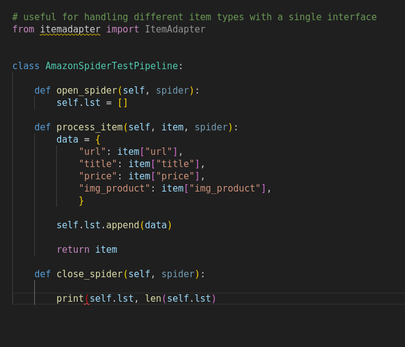
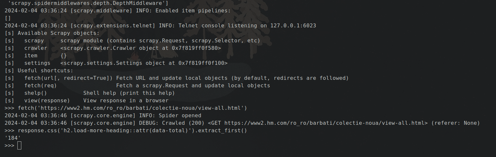

# Scrapy: few example for presentation
### Scrapers written in Python3 with Scrapy and Playwright

#### Little example from Scrapy

#### Pipeplines

#### First tests in "scrapy shell"

I have extensively worked with Scrapy, a Python web scraping framework, to extract and analyze 
data from various websites. Leveraging its flexible architecture and powerful features, I have 
successfully developed efficient web scraping solutions for diverse projects.
