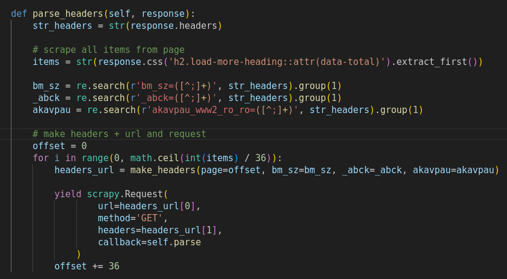

# Scrapy: few example for presentation
### Scrapers written in Python3 with Scrapy and Playwright

Big sites are more complex, but is not a problem. If them cannot acces with simple https requests with scrapy,
we can configure Playwright in project. But exist and also variants: Splash, Selenium etc.
For more complex and strongs sites we can make a build project with only Selenium, like my below 
projects:

[Selenium app for SEO Analysis](https://github.com/andreireporter13/SEO-1st-page-Google-data-scrape)
This project have configured web driver with Selenium. I configured here more complex logic: antibot detection
and proxy.
[Browser Config for Selenium](https://github.com/andreireporter13/SEO-1st-page-Google-data-scrape/blob/SEO-1st-page-Google-data-scrape/browser_settings/browser_settings_file.py)

And video presentation:

The big Scrapy project I made for peviitor.ro.
[Scrapy full automated project](https://github.com/peviitor-ro/Scrapy_peviitor_jobs)
In this project I configured Scrapy for crawling, process items and update API data on peviitor.ro. Scrapy is the best options
when you have a big project for scraping. It is easy to use and if someone else will be work in your project, he will be 
understand everything. 
[][(https://www.youtube.com/watch?v=i_fkt29UuPs&t=4s "Scrapy Project")]

My another project is for Peviitor.ro: Job Search Engine. 
[Peviitor Project - Custom build for Scraping](https://github.com/peviitor-ro/Scrapers_start_with_digi)
Here is about my custom solution for scraping and for new joiners. Here is very easy to create on of template for scraping.
The people who will use this project can easily create new scraper:

>  You can create new files for scrapers from ->
>  ... your terminal. For example:
>  python3 __create_scraper.py "name_scraper" "link" "type_scraper"
>  Its really useful when you have a lot of scrapers.
>
>  You can create your own scraper:
>  ... static
>  ... dynamic_json_get
>  ... dynamic_json_post
>  ... dynamic_render
>  ... custom

[File for create scraping template](https://github.com/peviitor-ro/Scrapers_start_with_digi/blob/main/new_sites/__create_scraper.py)
[Folder with __utils files for automate scraping process](https://github.com/peviitor-ro/Scrapers_start_with_digi/tree/main/new_sites/__utils)
[][(https://www.youtube.com/watch?v=icoCA8it9zw&t=351s "Custom Scraping Project")]

In this project I didn't use Selenium, because Github Actions have only 4gb ram for on time virtual machine. Instead I used requests_html, 
little browse emulator. It is enough for our work. 
In this project I used Singleton Pattern for more easily work with scrapers. The 5 of my students who use it is very nice, because they make
only instance and in instance come result, no needed to call another magic method.

#### Little example from Scrapy

#### Pipeplines

#### First tests in "scrapy shell"

I have extensively worked with Scrapy, a Python web scraping framework, to extract and analyze 
data from various websites. Leveraging its flexible architecture and powerful features, I have 
successfully developed efficient web scraping solutions for diverse projects.
